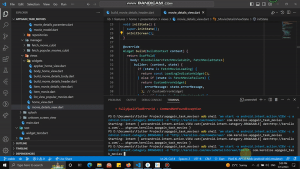
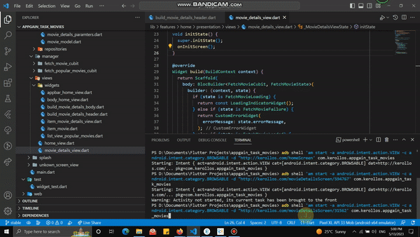
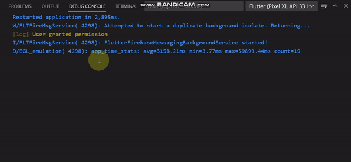
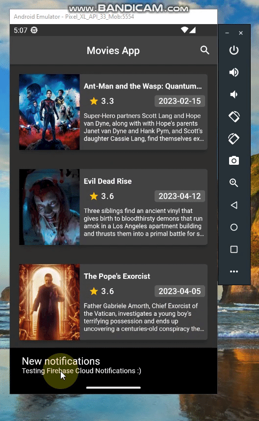

<h1 align="center">Movies App</h1>

[](https://www.linkedin.com/in/kerollos-ragaie/)
[](https://github.com/kerolosragaie)
> A flutter app uses, Deep links locally hosted without using firebase or any plugins, Firebase cloud notifications and logging API headers responses and Firebase notifications in debug mode only.

## APKs
>Release apk and debug apk will be found at:
[APKs link](https://github.com/kerolosragaie/movies_app/tree/master/assets/apks)

## Used API
[The Movie DB](https://developers.themoviedb.org/3/movies)

## App Screens:
1. "/" => Splash Screen
1. "/homeScreen" => Home Screen
1. "/movieDetailsScreen/:movieId" => Movie Details Screen
- Screens overview:


## Deep links:
> I don't have a website or any url to host, so the best solution is to implment deep links locally on the device using ADB (Android Debug Bridge) using any local domain (http://kerollos.com).

1. "http://kerollos.com/" => Runs splash screen 
1. "http://kerollos.com/homeScreen" => Runs home screen
1. "http://kerollos.com/movieDetailsScreen/:movieId" => Runs movie details screen to show the data for movie with id (:moviedId)

### Let's test deep links
> For sure if tryed to launch the app from any browser on the device it will not open because 'http://kerollos.com' is a local host, so the best solution to test if deep links works or no, I will call ADB and give it the local host 'http://kerollos.com' and my app package name 'com.kerollos.appgain_task_movies' like below:

1. Download and run the project and in the terminal type below line and press enter:

```Dart
adb shell 'am start -a android.intent.action.VIEW -c android.intent.category.BROWSABLE -d "http://kerollos.com/homeScreen' com.kerollos.appgain_task_movies 
```
2. And Home Screen will opens.
3. Now lets open /movieDetailsScreen/594767 to show the details of a movie called [Shazam! Fury of the Gods](https://api.themoviedb.org/3/movie/594767?api_key=c1ae2892932e63a1e39779087bb21e85&language=en-US/):



4. Now let's try again to open /movieDetailsScreen/33562 which is a move not found in data base (or if user tried to open any other screen not supported by the app) that what will be showen:



## Logging in debug mode only:
> Both API headers responses and Firebase notifications messages will be logged in debug mode like below:



## Firebase cloud notifications:
> Implemented both in Background as well as in Foreground notifications:




<h2 align="center">Thank you :)</h2>


